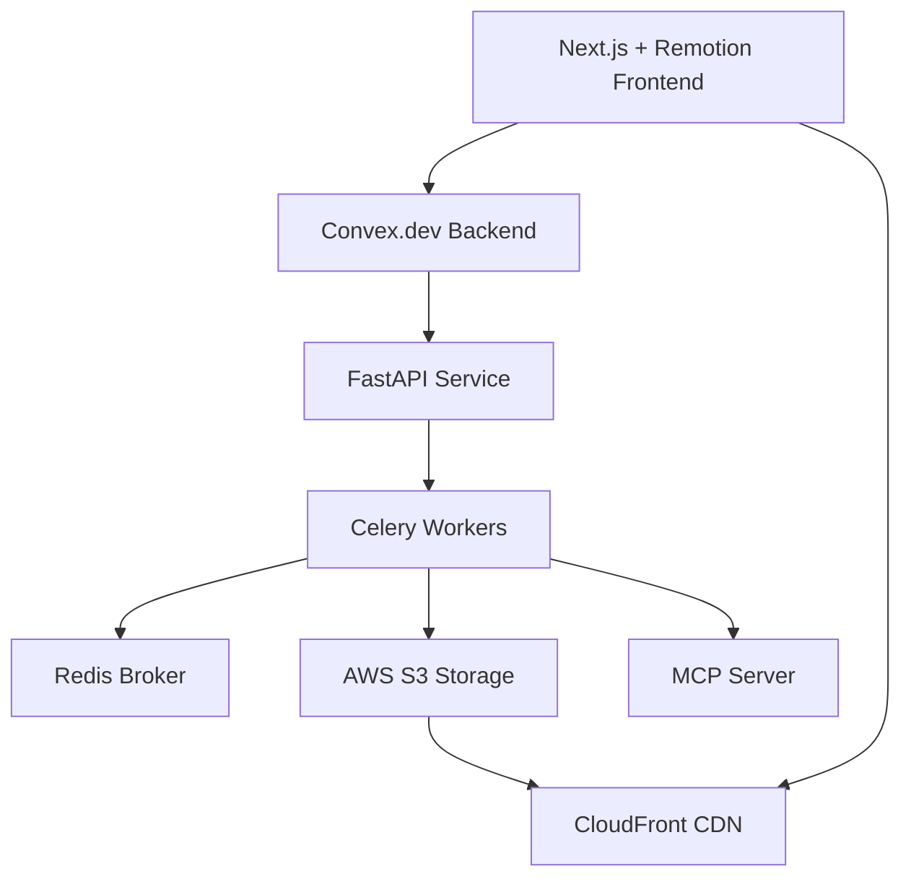

# Design Document

## Overview

The AI Video Tutor platform follows a microservices architecture with clear separation between the frontend (Next.js + Remotion), backend API (FastAPI), data layer (Convex.dev), and background processing (Celery + Redis). The system is designed for scalability, real-time updates, and efficient video processing through chunked rendering and S3 storage.

## Architecture

### High-Level Architecture



### Service Responsibilities

- **Next.js Frontend**: User interface, video preview, scene editing UI
- **Remotion**: Video composition and playback from chunks
- **Convex.dev**: Real-time data synchronization, authentication, CRUD operations
- **FastAPI**: API gateway, webhook handling, business logic orchestration with Convex Python SDK
- **Celery Workers**: Background video generation and scene processing using Convex Python SDK
- **Redis**: Message broker, task queue, caching layer
- **AWS S3**: Video chunk storage, source code storage
- **CloudFront**: CDN for fast video delivery
- **MCP Server**: Manim documentation and context provider

## Components and Interfaces

### Data Models

#### Convex Schema
```typescript
// Users table
users: {
  externalId: string,        // from NextAuth
  name?: string,
  email?: string,
  createdAt: number
}

// Projects table
projects: {
  ownerId: Id<"users">,
  title: string,
  description?: string,
  createdAt: number,
  updatedAt: number
}

// Video Sessions table
videoSessions: {
  projectId: Id<"projects">,
  status: "idle" | "queued" | "generating" | "rendering" | "ready" | "error",
  targetFps: number,         // 30
  width: number,             // 1920
  height: number,            // 1080
  codec: string,             // "h264"
  durationInFrames?: number,
  errorMessage?: string,
  jobId?: string,
  version: number,
  createdAt: number,
  updatedAt: number
}

// Scenes table
scenes: {
  projectId: Id<"projects">,
  sessionId: Id<"videoSessions">,
  index: number,             // 0-based ordering
  startFrame: number,        // cumulative based on previous scenes
  endFrame: number,          // inclusive end
  durationInFrames: number,
  title?: string,
  status: "queued" | "generating_code" | "rendering" | "uploading" | "ready" | "error",
  errorMessage?: string,
  s3ChunkKey?: string,       // versioned key
  s3ChunkUrl?: string,       // CloudFront URL
  s3SourceKey?: string,      // Manim code .py
  checksum?: string,         // SHA256 for cache busting
  jobId?: string,
  version: number,
  updatedAt: number
}
```

### API Contracts

#### FastAPI Endpoints
```python
# Video generation (called by Convex actions)
POST /jobs/generate
{
  "projectId": string,
  "sessionId": string,
  "sceneCount": number,
  "prompt": string
}

# Scene editing (called by Convex actions)
POST /jobs/edit
{
  "sceneId": string,
  "projectId": string,
  "prompt": string
}
```

#### Convex Actions (TypeScript)
```typescript
// Frontend triggers these actions
api.jobs.triggerGenerate(projectId, sessionId, sceneCount, prompt)
api.jobs.triggerEdit(sceneId, prompt)
```

#### Convex Python SDK Integration
```python
# In FastAPI and Celery workers
from convex import ConvexClient

# Initialize client
convex = ConvexClient(deployment_url, admin_key)

# Update data directly from Python
await convex.mutation("scenes:updateStatus", {
    "sceneId": scene_id,
    "status": "rendering",
    "updatedAt": time.time() * 1000
})

# Query data from Python
scenes = await convex.query("scenes:listBySession", {
    "sessionId": session_id
})
```

### Authentication Flow

1. User authenticates via NextAuth (GitHub/Google OAuth)
2. NextAuth provides stable `externalId` mapped to Convex user
3. All API calls include user context for authorization
4. Webhook calls use HMAC signatures for security

### Video Processing Pipeline

#### Generation Flow
1. User submits content prompt via frontend
2. Convex action triggers FastAPI `/jobs/generate` endpoint with HMAC signature
3. FastAPI queues Celery task and returns immediately
4. Celery worker uses Convex Python SDK to update session status to "generating"
5. Celery task breaks prompt into scenes using AI and creates scene records in Convex
6. For each scene: Celery worker updates scene status to "generating_code" via Convex SDK
7. Each scene generates Manim code via MCP-enhanced AI agent
8. Celery worker updates scene status to "rendering" via Convex SDK
9. Dockerized Manim workers render each scene to MP4
10. Video chunks uploaded to S3 with versioned keys
11. Celery worker uses Convex SDK to update scene with S3 URLs and "ready" status
12. Frontend receives real-time updates via Convex subscriptions and displays video

#### Editing Flow
1. User selects scene and submits edit prompt
2. Convex action triggers FastAPI `/jobs/edit` endpoint with HMAC signature
3. FastAPI queues Celery edit task and returns immediately
4. Celery worker uses Convex Python SDK to update scene status to "generating_code"
5. Celery task retrieves original Manim code from S3
6. AI agent modifies code based on edit prompt and MCP context
7. Celery worker updates scene status to "rendering" via Convex SDK
8. Modified scene re-rendered in Docker container
9. Celery worker updates scene status to "uploading" via Convex SDK
10. New video chunk uploaded with incremented version to S3
11. Celery worker uses Convex SDK to update scene with new URLs and "ready" status
12. Frontend receives real-time updates via Convex subscriptions and updates video player

## Data Models

### State Machine Design

#### Session Status Flow
```
idle → queued → generating → rendering → ready
  ↓                                        ↓
error ←----------------------------------error
```

#### Scene Status Flow
```
queued → generating_code → rendering → uploading → ready
   ↓           ↓              ↓           ↓         ↓
 error ←----- error ←------- error ←---- error ← error
```

### S3 Storage Structure

```
Buckets:
- ai-video-tutor-chunks (public via CloudFront)
- ai-video-tutor-sources (private)

Keys:
- chunks: projects/{projectId}/sessions/{sessionId}/scenes/{index}/v{sceneVersion}.mp4
- sources: projects/{projectId}/sessions/{sessionId}/scenes/{index}/v{sceneVersion}.py
```

## Error Handling

### Retry Strategy
- Celery tasks: exponential backoff, max 3 attempts
- Network requests: circuit breaker pattern
- Video rendering: timeout after 5 minutes per scene
- Failed tasks: mark as error state, preserve original content

### Error Propagation
- Structured logging with correlation IDs
- Error messages surfaced in Convex for UI display
- Failed scenes don't block other scenes in session
- Users can retry individual failed operations

### Monitoring
- Task execution times logged
- Queue depth monitoring
- S3 upload/download metrics
- Error rate tracking by operation type

## Testing Strategy

### Unit Tests
- Convex functions (mutations, queries, actions)
- FastAPI endpoints and request validation
- Celery task logic and error handling
- Utility functions (S3 operations, HMAC signing)

### Integration Tests
- End-to-end video generation workflow
- Scene editing and re-rendering pipeline
- Real-time updates from Convex to frontend
- Authentication and authorization flows

### Performance Tests
- Concurrent video generation load
- Large scene count handling
- S3 upload/download performance
- Redis queue performance under load

### End-to-End Tests
- Complete user workflows in browser
- Video playback and seeking accuracy
- Error scenarios and recovery
- Cross-browser compatibility

## Security Considerations

### Authentication & Authorization
- OAuth-based authentication via NextAuth
- User-scoped data access in Convex
- RBAC: users can only access their own projects

### API Security
- HMAC-signed webhooks with timestamp validation
- Request rate limiting on public endpoints
- Input validation and sanitization
- No sensitive credentials in frontend

### Data Protection
- S3 write credentials server-side only
- Video chunks served via CloudFront (no direct S3 access)
- Source code stored in private S3 bucket
- Correlation IDs for audit trails

### Infrastructure Security
- Docker containers for rendering isolation
- Resource limits on Manim workers
- Network segmentation between services
- Environment-based configuration management