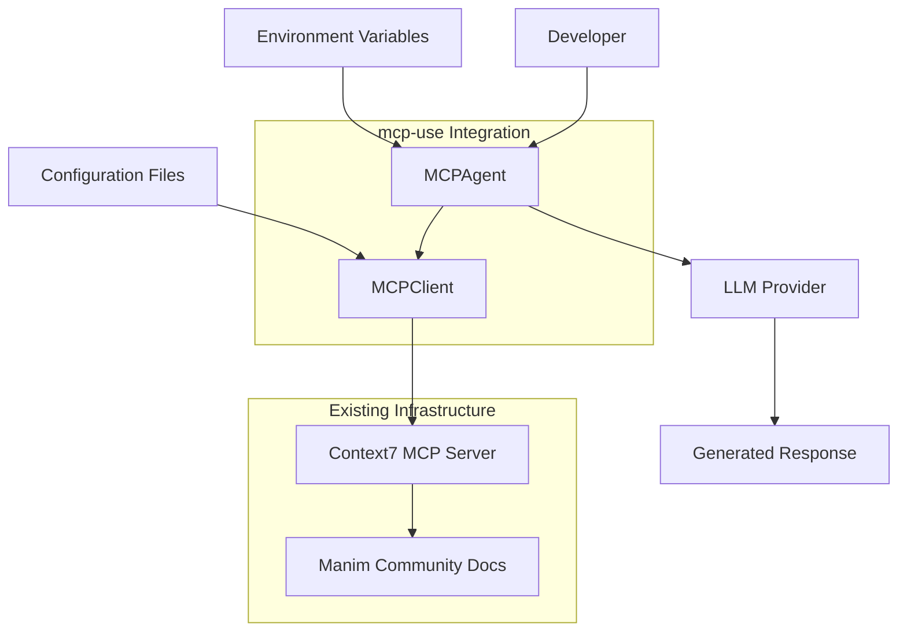

# Design Document

## Overview

This design outlines the integration of mcp-use library with Context7 MCP server to enable AI agents to access Manim Community documentation dynamically. The solution replaces traditional RAG approaches with real-time documentation retrieval through the Model Context Protocol, providing agents with up-to-date Manim Community documentation and code examples.

The integration leverages the existing Context7 MCP server configuration and extends it with mcp-use to create intelligent agents capable of providing accurate Manim guidance based on current documentation.

## Architecture

### High-Level Architecture



### Component Interaction Flow

1. **Developer Query**: Developer asks agent about Manim functionality
2. **Agent Processing**: MCPAgent receives query and determines need for documentation
3. **Documentation Retrieval**: MCPClient calls Context7 MCP server to retrieve relevant Manim docs
4. **LLM Integration**: Retrieved documentation is fed to LLM along with original query
5. **Response Generation**: LLM generates response based on current documentation
6. **Result Delivery**: Agent returns accurate, up-to-date Manim guidance

## Components and Interfaces

### MCPClient Configuration

**Purpose**: Manages connection to Context7 MCP server for Manim documentation access

**Interface**:
```python
from mcp_use import MCPClient

client = MCPClient.from_config_file("mcp_config.json")
```

**Configuration Structure**:
```json
{
  "mcpServers": {
    "context7": {
      "command": "npx",
      "args": ["-y", "@upstash/context7-mcp"]
    }
  }
}
```

### MCPAgent Implementation

**Purpose**: Creates intelligent agents that can query Manim documentation and provide guidance

**Interface**:
```python
from mcp_use import MCPAgent
from langchain_openai import ChatOpenAI

agent = MCPAgent(
    llm=ChatOpenAI(model="gpt-4o"),
    client=client,
    max_steps=10,
    system_prompt="You are a Manim expert assistant with access to current documentation."
)
```

**Key Features**:
- Integration with Context7 for documentation retrieval
- LLM integration for response generation
- Configurable step limits and timeouts
- System prompt customization for Manim-specific guidance

### Context7 Integration Layer

**Purpose**: Handles communication with Context7 MCP server for Manim documentation

**Key Functions**:
- Library ID resolution for Manim Community (`/manimcommunity/manim`)
- Documentation retrieval with topic filtering
- Code snippet extraction
- Error handling for failed retrievals

### Environment Configuration

**Purpose**: Manages API keys and configuration settings securely

**Required Environment Variables**:
```env
OPENAI_API_KEY=sk-...
# Or other LLM provider keys:
# ANTHROPIC_API_KEY=sk-ant-...
# GROQ_API_KEY=gsk_...
```

## Data Models

### Agent Query Model

```python
class AgentQuery:
    query: str              # User's question about Manim
    context: Optional[str]  # Additional context
    max_docs: int = 5       # Maximum documentation snippets to retrieve
```

### Documentation Response Model

```python
class DocumentationResponse:
    snippets: List[CodeSnippet]  # Retrieved code examples
    descriptions: List[str]      # Documentation descriptions
    sources: List[str]          # Source URLs
    library_id: str             # Context7 library identifier
```

### Agent Response Model

```python
class AgentResponse:
    answer: str                    # Generated response
    code_examples: List[str]       # Extracted code examples
    documentation_used: List[str]  # Sources referenced
    confidence: float              # Response confidence score
```

## Error Handling

### Connection Errors

**Context7 Server Unavailable**:
- Implement retry mechanism with exponential backoff
- Fallback to cached documentation if available
- Clear error messages for troubleshooting

**MCP Client Initialization Failures**:
- Validate configuration file format
- Check server command availability
- Provide detailed error diagnostics

### Documentation Retrieval Errors

**Library Not Found**:
- Verify Manim Community library ID (`/manimcommunity/manim`)
- Implement fallback to alternative Manim sources
- Log retrieval attempts for debugging

**Rate Limiting**:
- Implement request throttling
- Cache frequently requested documentation
- Provide user feedback on rate limits

### Agent Execution Errors

**LLM API Failures**:
- Retry with exponential backoff
- Fallback to alternative LLM providers if configured
- Graceful degradation with cached responses

**Timeout Handling**:
- Configurable timeout settings
- Partial response delivery when possible
- Clear timeout error messages

## Testing Strategy

### Unit Tests

**MCPClient Tests**:
- Configuration file parsing
- Server connection establishment
- Error handling scenarios

**MCPAgent Tests**:
- Query processing logic
- Documentation integration
- Response generation

**Context7 Integration Tests**:
- Library ID resolution
- Documentation retrieval
- Error handling

### Integration Tests

**End-to-End Workflow**:
- Complete query-to-response flow
- Multi-step agent interactions
- Documentation accuracy validation

**Performance Tests**:
- Response time measurements
- Memory usage monitoring
- Concurrent request handling

### Verification Tests

**Installation Verification**:
- Component installation checks
- Configuration validation
- API key verification

**Documentation Accuracy**:
- Compare retrieved docs with official sources
- Validate code example syntax
- Check documentation freshness

## Security Considerations

### API Key Management

- Store keys in environment variables only
- Never commit keys to version control
- Use `.env` files for local development
- Implement key rotation procedures

### Sandboxed Execution

- Optional E2B sandbox integration for code execution
- Isolated environment for testing generated code
- Resource limits for sandbox operations

### Tool Restrictions

- Configurable tool access controls
- Disable dangerous operations (shell access, file system writes)
- Audit logging for tool usage

## Performance Optimization

### Caching Strategy

- Cache frequently requested documentation
- Implement TTL for cache entries
- Memory-efficient cache storage

### Connection Management

- Connection pooling for MCP servers
- Lazy loading of server connections
- Efficient resource cleanup

### Response Optimization

- Streaming responses for long queries
- Partial documentation loading
- Optimized token usage for LLM calls

## Deployment Considerations

### Development Environment

- Local MCP server setup
- Development configuration files
- Debug logging and monitoring

### Production Environment

- Scalable MCP server deployment
- Load balancing for multiple agents
- Monitoring and alerting systems

### Configuration Management

- Environment-specific configurations
- Secure credential management
- Configuration validation and testing