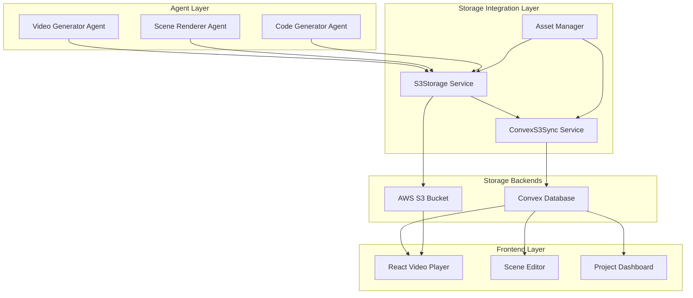
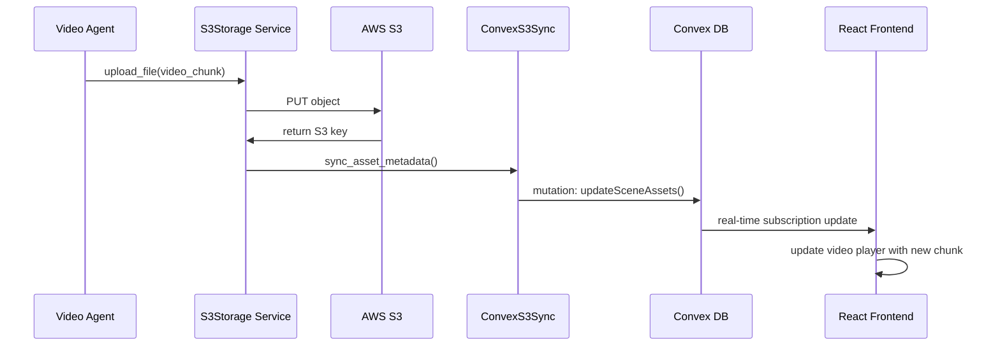

# Design Document

## Overview

The S3-Convex Integration design creates a seamless bridge between the existing S3 storage system and Convex.dev database for the AI Video Tutor platform. This integration ensures that all video assets, scene metadata, and file references are properly synchronized between AWS S3 and Convex, enabling efficient content delivery, version management, and real-time updates.

The design leverages the existing `S3Storage` class from `agents/src/storage/s3_storage.py` and extends the current Convex schema to include S3 asset tracking fields. It implements a dual-storage approach where files are stored in S3 for scalability and cost-effectiveness, while metadata and URLs are managed in Convex for real-time synchronization and query performance.

## Architecture

### High-Level Architecture



### Data Flow Architecture



## Components and Interfaces

### 1. ConvexS3Sync Service

**Location**: `backend/app/services/convex_s3_sync.py`

**Purpose**: Orchestrates synchronization between S3 operations and Convex database updates.

**Key Methods**:
- `sync_scene_assets(scene_id, s3_assets)`: Updates scene with S3 asset URLs
- `sync_session_assets(session_id, s3_assets)`: Updates video session with combined assets
- `batch_sync_assets(asset_batch)`: Handles bulk asset synchronization
- `cleanup_orphaned_assets(project_id)`: Removes references to deleted S3 assets

**Interface**:
```python
class ConvexS3Sync:
    def __init__(self, convex_client: ConvexClient, s3_storage: S3Storage)
    
    async def sync_scene_assets(
        self, 
        scene_id: str, 
        s3_assets: Dict[str, str],
        metadata: Optional[Dict] = None
    ) -> Dict
    
    async def sync_session_assets(
        self, 
        session_id: str, 
        combined_assets: Dict[str, str]
    ) -> Dict
    
    async def batch_sync_assets(
        self, 
        asset_batch: List[AssetSyncRequest]
    ) -> List[Dict]
```

### 2. Enhanced S3Storage Integration

**Location**: Extends existing `agents/src/storage/s3_storage.py`

**New Methods**:
- `upload_with_convex_sync()`: Uploads to S3 and triggers Convex sync
- `get_asset_manifest()`: Retrieves comprehensive asset information
- `cleanup_with_convex_sync()`: Deletes from S3 and updates Convex

**Enhanced Interface**:
```python
class S3Storage:
    # Existing methods remain unchanged
    
    def upload_with_convex_sync(
        self, 
        local_path: str, 
        key: str, 
        convex_sync: ConvexS3Sync,
        entity_id: str,
        entity_type: str
    ) -> Tuple[str, str]  # Returns (s3_key, url)
    
    def get_asset_manifest(self, key_prefix: str) -> Dict[str, Any]
    
    def cleanup_with_convex_sync(
        self, 
        keys: List[str], 
        convex_sync: ConvexS3Sync,
        entity_id: str
    ) -> bool
```

### 3. Asset Manager Service

**Location**: `backend/app/services/asset_manager.py`

**Purpose**: High-level service for managing asset lifecycle across S3 and Convex.

**Key Responsibilities**:
- Coordinate asset uploads with proper metadata
- Handle asset versioning and cleanup
- Provide unified asset access interface
- Manage asset permissions and access control

**Interface**:
```python
class AssetManager:
    def __init__(self, s3_storage: S3Storage, convex_sync: ConvexS3Sync)
    
    async def store_scene_asset(
        self, 
        scene_id: str, 
        asset_type: AssetType, 
        file_path: str,
        metadata: Optional[Dict] = None
    ) -> AssetReference
    
    async def get_scene_assets(self, scene_id: str) -> List[AssetReference]
    
    async def cleanup_scene_assets(self, scene_id: str) -> bool
    
    async def get_asset_url(
        self, 
        asset_id: str, 
        url_type: UrlType = UrlType.PUBLIC
    ) -> str
```

### 4. Enhanced Convex Schema

**Location**: `backend/convex/types/schema.py`

**Schema Extensions**:

```python
class S3Asset(BaseModel):
    s3Key: str
    s3Url: str
    contentType: str
    size: int
    checksum: str
    uploadedAt: float

class Scene(BaseModel):
    # Existing fields...
    
    # S3 Asset References
    videoAsset: Optional[S3Asset] = None
    sourceCodeAsset: Optional[S3Asset] = None
    thumbnailAsset: Optional[S3Asset] = None
    subtitleAsset: Optional[S3Asset] = None
    
    # Asset Status Tracking
    assetsStatus: Literal["pending", "uploading", "ready", "error"] = "pending"
    assetsErrorMessage: Optional[str] = None
    
    # Version Management
    assetVersion: int = 1
    previousAssetVersions: List[S3Asset] = []

class VideoSession(BaseModel):
    # Existing fields...
    
    # Combined Video Assets
    combinedVideoAsset: Optional[S3Asset] = None
    combinedSubtitleAsset: Optional[S3Asset] = None
    
    # Manifest Reference
    manifestAsset: Optional[S3Asset] = None
    
    # Asset Summary
    totalAssetSize: int = 0
    assetCount: int = 0
```

## Data Models

### Asset Reference Model

```python
class AssetReference(BaseModel):
    id: str
    entityId: str  # scene_id or session_id
    entityType: Literal["scene", "session"]
    assetType: AssetType
    s3Key: str
    s3Url: str
    contentType: str
    size: int
    checksum: str
    version: int
    createdAt: float
    metadata: Optional[Dict] = None

class AssetType(Enum):
    VIDEO_CHUNK = "video_chunk"
    SOURCE_CODE = "source_code"
    THUMBNAIL = "thumbnail"
    SUBTITLE = "subtitle"
    COMBINED_VIDEO = "combined_video"
    MANIFEST = "manifest"
```

### Sync Request Models

```python
class AssetSyncRequest(BaseModel):
    entityId: str
    entityType: str
    s3Key: str
    s3Url: str
    assetType: AssetType
    metadata: Optional[Dict] = None

class BatchSyncResponse(BaseModel):
    successful: List[str]  # entity_ids
    failed: List[Tuple[str, str]]  # (entity_id, error_message)
    totalProcessed: int
```

## Error Handling

### Error Categories

1. **S3 Upload Errors**
   - Network connectivity issues
   - Authentication/authorization failures
   - Storage quota exceeded
   - Invalid file formats

2. **Convex Sync Errors**
   - Database connection failures
   - Schema validation errors
   - Concurrent modification conflicts
   - Rate limiting

3. **Data Consistency Errors**
   - S3 upload success but Convex update failure
   - Convex update success but S3 upload failure
   - Partial batch operation failures

### Error Recovery Strategies

```python
class ErrorRecoveryManager:
    async def handle_s3_upload_failure(
        self, 
        upload_request: UploadRequest, 
        error: Exception
    ) -> RecoveryAction
    
    async def handle_convex_sync_failure(
        self, 
        sync_request: AssetSyncRequest, 
        error: Exception
    ) -> RecoveryAction
    
    async def reconcile_data_inconsistency(
        self, 
        entity_id: str, 
        inconsistency_type: InconsistencyType
    ) -> bool
```

### Retry Logic

- **Exponential Backoff**: Start with 1s, max 60s, 3 attempts
- **Circuit Breaker**: Fail fast after 5 consecutive failures
- **Dead Letter Queue**: Store failed operations for manual review
- **Compensation Transactions**: Rollback partial operations

## Testing Strategy

### Unit Tests

1. **S3Storage Integration Tests**
   - Mock S3 operations with moto library
   - Test upload, download, and delete operations
   - Verify URL generation for different configurations

2. **ConvexS3Sync Tests**
   - Mock Convex client operations
   - Test asset synchronization logic
   - Verify error handling and retry mechanisms

3. **Asset Manager Tests**
   - Test high-level asset operations
   - Verify proper coordination between S3 and Convex
   - Test asset lifecycle management

### Integration Tests

1. **End-to-End Asset Flow**
   - Upload video chunk through complete pipeline
   - Verify S3 storage and Convex metadata sync
   - Test real-time updates to frontend

2. **Error Scenario Testing**
   - Simulate S3 failures during upload
   - Test Convex connection failures
   - Verify data consistency recovery

3. **Performance Testing**
   - Batch upload operations
   - Concurrent asset operations
   - Large file handling

### Test Environment Setup

```python
# Test Configuration
TEST_CONFIG = {
    "s3": {
        "bucket": "test-ai-video-tutor",
        "endpoint_url": "http://localhost:9000",  # MinIO
        "force_path_style": True
    },
    "convex": {
        "url": "http://localhost:8000",  # Local Convex dev
        "deployment": "test"
    }
}
```

## Performance Considerations

### Optimization Strategies

1. **Batch Operations**
   - Group multiple asset uploads into single S3 operations
   - Batch Convex mutations to reduce database transactions
   - Implement intelligent batching based on file sizes

2. **Caching Layer**
   - Cache frequently accessed asset URLs in Redis
   - Implement CDN integration for public assets
   - Use Convex query caching for asset metadata

3. **Async Processing**
   - Use Celery for background asset processing
   - Implement async/await patterns throughout
   - Queue non-critical operations (thumbnails, manifests)

4. **Connection Pooling**
   - Reuse S3 client connections
   - Implement Convex client connection pooling
   - Optimize database connection management

### Monitoring and Metrics

```python
class AssetMetrics:
    upload_duration: Histogram
    sync_duration: Histogram
    error_rate: Counter
    asset_size_distribution: Histogram
    concurrent_operations: Gauge
```

## Security Considerations

### Access Control

1. **S3 Security**
   - Use IAM roles with minimal required permissions
   - Implement bucket policies for cross-account access
   - Enable S3 server-side encryption (SSE-KMS)

2. **Convex Security**
   - Implement row-level security for asset access
   - Use Convex Auth for user authentication
   - Validate all asset operations against user permissions

3. **URL Security**
   - Generate time-limited presigned URLs for private content
   - Implement proper CORS policies
   - Use HTTPS for all asset URLs

### Data Protection

```python
class SecurityManager:
    def generate_secure_asset_url(
        self, 
        asset_id: str, 
        user_id: str, 
        expiration: int = 3600
    ) -> str
    
    def validate_asset_access(
        self, 
        asset_id: str, 
        user_id: str
    ) -> bool
    
    def encrypt_sensitive_metadata(
        self, 
        metadata: Dict
    ) -> Dict
```

## Deployment Strategy

### Environment Configuration

1. **Development**
   - Use MinIO for S3 compatibility
   - Local Convex development server
   - Simplified authentication

2. **Staging**
   - AWS S3 with staging bucket
   - Convex staging deployment
   - Full authentication flow

3. **Production**
   - AWS S3 with production bucket and CloudFront
   - Convex production deployment
   - Enhanced monitoring and alerting

### Migration Plan

1. **Phase 1**: Deploy new schema and services without breaking existing functionality
2. **Phase 2**: Migrate existing assets to new S3-Convex integration
3. **Phase 3**: Update frontend to use new asset URLs
4. **Phase 4**: Remove legacy asset handling code

### Rollback Strategy

- Maintain backward compatibility during migration
- Implement feature flags for gradual rollout
- Keep legacy asset URLs functional during transition
- Automated rollback triggers based on error rates